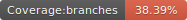
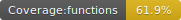
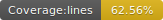
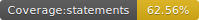

# Back To Js - Core

<p float="left">
  
  
  
  
</p>

<p align="center">
    
</p>


---

A framework to help us to back the time in which javascript was simple, intuitive and without insane concepts.

Just html + javascript

# Features

- Pure html. Forgot alien tags or attributes:
  - `<App> <MuiThemeProvider> <app-navigation> *ngIf="!authService.isLoggedIn()" <Drawer open containerStyle={{ position: null }}>`
- Just your web code. Forgot alien files `.babelrc .eslintrc tslint.json .etc`
- Annotations like java or c#
- Dependency Injection
- Automatic actionable elements detection
- Automatic router binding
- Compatible with any fucking javascript framework in the world

# Demo

Check the first demo:

- https://github.com/backtojs/backtojs-demos

# How it works?

Just install the tool, create the project, add your js and run it

## Install

Install the tool

```
npm install -g github:/backtojs/backtojs-core
```

## Create new project

```
backtojs --new-project acme
cd ./acme
```

## Add your html

**/src/pages/HelloWorld.html**
```html
[HelloWorld]
<h1>Hello World Example</h1>
<p>This is a very basic "Hello World" example made up in HTML and CSS</p>
```

## Add your controller

**/src/controllers/HelloWorldController.js**

```js
[Controller(entrypoint="true")]
function HelloWorldController() {

  [Autowire(name="HelloWorld")]
  this.page;

  [OnLoad]
  this.onLoad = () => {
    console.log("onLoad: Hello World!!");
  };

  [Render]
  this.render = () => {
    return this.page.getHtml();
  };

}

module.exports = HelloWorldController;
```

## Start as dev

```
npm run dev
```

Go to http://localhost:1308

## Documentation

- coming soon

## Samples

- coming soon

## Acknowledgments

- <a href="https://www.textstudio.com/">Font generator</a>
  - https://www.textstudio.com/logo/back-to-the-past-text-243
- My first idea was in 2018. Project in that time called Lassie.js https://github.com/BackToJs/backtojs-core/tree/1.0.1-beta

## Contributors

<table>
  <tbody>
    <td>
      
      <br />
      <label><a href="http://jrichardsz.github.io/">jrichardsz</a></label>
      <br />
    </td>    
  </tbody>
</table>
